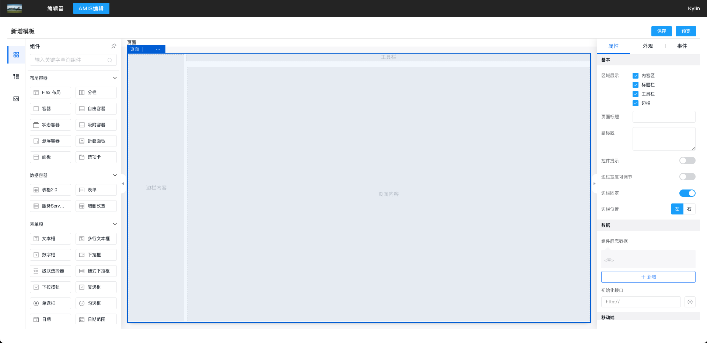
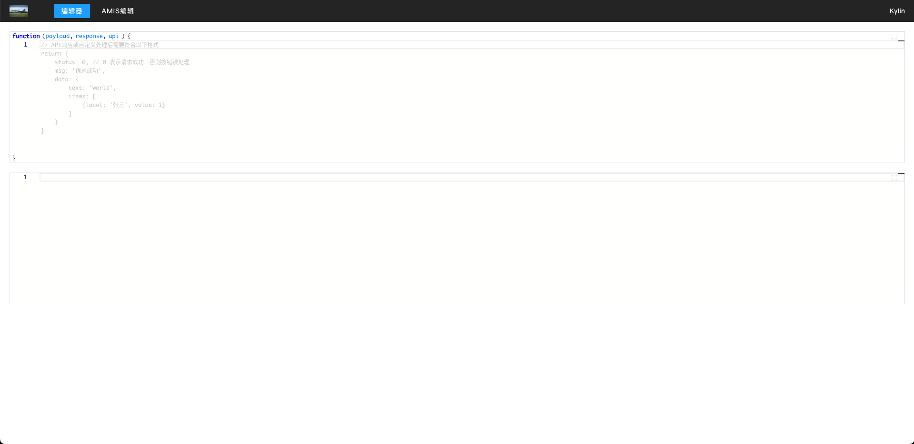

# Vue2中的一些demo

- [ ] 使用amis
- [x] monaco编辑器封装

## amis-demo



## monaco-editor-demo

]

## Setup

Install the dependencies:

```bash
pnpm install
```

## Get started

Start the dev server:

```bash
pnpm dev
```

Build the app for production:

```bash
pnpm build
```

Preview the production build locally:

```bash
pnpm preview
```
